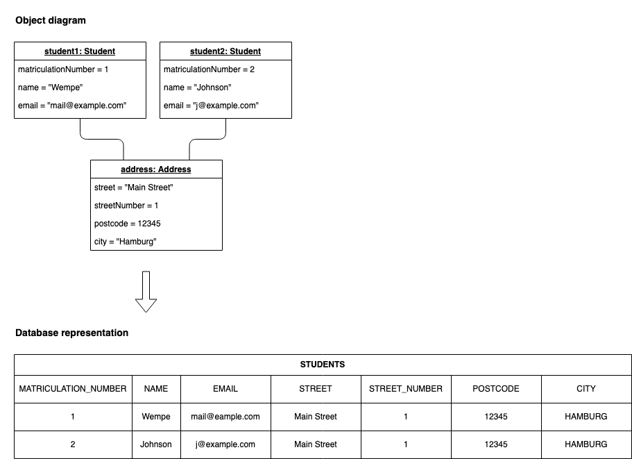

import Callout from '../../../components/Callout.astro';

In my [last post about Domain-Driven Design (DDD)](https://wempe.dev/blog/domain-driven-design-introduction) I
explained why DDD is (still) relevant and what it actually is. I explained the basic terms like _Domain_, _Model_,
_Ubiquitous Language_, and _Bounded Context_.

DDD can be divided into **Strategic and Tactical Design** where the Tactical Design is about the building blocks of DDD.
This post will be about the basic building blocks of DDD: **_Entities and Value Objects (VOs)_**. Entities and VOs are
two of the building blocks in DDD expressing the model. They are the starting points for Domain-Driven Design (besides
Services and Domain Events).


Besides just looking at the definitions of Entity and VO, I will also provide you with some guidance on how to
distinguish them.

## Building Blocks of DDD

In this chapter, I will be explaining the concepts of an Entity and a VO. There are more building blocks in DDD, like
Services and Domain Events (see the image above), but they will be out of scope for this post.

### Entities

This is how Entities are introduced in the DDD book by Eric Evans:

> Many objects are not fundamentally defined by their attributes, but rather by a thread of **continuity and identity**.

This sentence already introduces the main characteristics of an Entity: **continuity** (also often referred to as having
a lifecycle) and **identity**.

> An object primarily defined by its identity is called an Entity.

When you think of an Entity, imagine something that needs to be tracked over time and whose attributes are likely to
change over time. To be able to keep track of something you need a way of identifying the object and answering the
question "Is this the same object?" after time has passed. A very strong indicator of something being an Entity is
something like a `status` attribute (like `pending`, `active`, or `inactive`) or attribute prefixes like `current` or
`last`.

An object has to be distinguishable even though the attributes of different objects are the same. Think of an
application for managing students enrolling in different courses at a university. A `Student` will be the same student
if attributes like `email` or even `name` change. It is important to define what it means for a student to be the same
student. Maybe it would be something like `matriculationNumber` or just a generic `id`. The following image shows a
potential class diagram for this application, which I'll use as an example from now on.


This could be the database representation of an actual instance of the `Student` Entity _(for simplicity the_ `Course`
is committed as it isn't really required to prove my point later on):


You have to answer the question **"What makes an object the same object?"** from a domain perspective. Therefore
defining the identity of an Entity demands understanding of the domain.

> Be alert to requirements that call for matching objects by attributes.

Meaning that a requirement like "The object should be the same if the attributes are the same." is a strong indicator
that it is probably not an Entity at all.

Entities are also called **"Reference Objects"**. I like this term because I have an image in my head where a pointer
(an arrow) is referencing the same object over time.

(In JPA the annotation `@Entity` is used for Entities.)

### Value Objects (VOs)

> Many objects have **no conceptual identity**. These objects describe some **characteristics of a thing**.

VOs do not have an identity. They are defined by their attributes instead of an identifier. You can think of VOs as a
complex attribute of an Entity.

> An object that represents a descriptive aspect of the domain with no conceptual identity is called a Value Object.
> Value Objects are instantiated to represent elements of the design that we **care about only for _what_ they are**,
> not _who_ or _which_ they are.

Think back to the student example in the Entities section. The `Student` could have an `Address`, which consists of
`street`, `streetNumber`, `postcode`, and `city`. In the domain of our application, the address would be a VO. Changing
one of the attributes would make it a different address. An address is more like a **complex attribute type** (instead
of a primitive data type like string, boolean, etc.) **of an Entity (or other VOs;** in this case of the Entity
`Student`).


Not caring about the identity of an object gives us the freedom to simplify our design and optimize performance. We can
now share instances of VOs because they are essentially like a complex attribute holding some information. **BUT** in
order to do so, the **VO has to be immutable**. Changing VOs attributes has to result in creating a new instance and not
in modifying the existing one.

Again, back to the student example. Think of two students living at the same address. They can share the same instance
of the `Address` VO, but if one of the students moves somewhere else we don't want to mutate that instance because that
would affect the other student as well. Instead, we end up creating a new `Address` instance (or reusing an existing
instance of that address if it exists). Sharing a VO instance is shown in the next image. It also showcases how the VO acts like a complex attribute of the Entity.



Do not attach artificial IDs to a VO. VOs are typically embedded rather than stored in their own table, though practical concerns like querying may justify separate tables. The key is that VOs should have no _conceptual_ identity—adding one would muddle the model by forcing all objects into the same mold.

Because of the aforementioned benefits of VOs, you should go with a VO as a default and only ever assign an identity to
something (and therefore make it an Entity) if it is required to do so.

(In JPA the annotation `@Embeddable` (1:1) and `@ElementCollection` (1:n) are used for VOs).

## Distinguish Entities and Value Objects

This post focuses on Entities and VOs because they are similar but different. One question I asked myself frequently
was: "Is this an Entity or a Value Object?". Both are modeling actual data and are most often persisted in a database.
But as we already learned, there are differences in Entities and VOs.

The following table showcases the main differences between Entities and Value Objects:


### Equality Semantics

One of the most practical differences between Entities and VOs is how you compare them for equality:

- **Entities**: Two instances are equal if they have the same identity (ID), regardless of their attributes.
- **Value Objects**: Two instances are equal if all their attributes are equal.

This distinction reflects their nature: an Entity _is_ something (identified), while a VO _describes_ something (by its attributes).

### Code Example

Using the student example from above, here's how you might implement an Entity and a VO in TypeScript:

```typescript
// Value Object: Immutable, equality by attributes
class Address {
  constructor(
    readonly street: string,
    readonly streetNumber: string,
    readonly postcode: string,
    readonly city: string
  ) {}

  equals(other: Address): boolean {
    return (
      this.street === other.street &&
      this.streetNumber === other.streetNumber &&
      this.postcode === other.postcode &&
      this.city === other.city
    );
  }

  // VOs are immutable - changing returns a new instance
  withCity(city: string): Address {
    return new Address(this.street, this.streetNumber, this.postcode, city);
  }
}

// Entity: Identity-based equality, mutable attributes
class Student {
  constructor(
    readonly matriculationNumber: string, // identity
    public name: string,
    public email: string,
    public address: Address
  ) {}

  equals(other: Student): boolean {
    // Only compare by identity, not attributes
    return this.matriculationNumber === other.matriculationNumber;
  }
}
```

Notice how `Address.equals()` compares all attributes while `Student.equals()` only compares the identity. The `Address` is immutable (all fields `readonly`, changes create new instances), while `Student` allows attribute mutations because we track the same student over time.

The following questions can help to identify an Entity or a VO:

**_Can I replace the object with another object having the same attributes?_**

**If the answer is yes, it is a Value Object.** As already mentioned, VOs are like a complex data type. You could also
think of primitive data type as an integer as a VO. So, is your object somehow like an integer?

**_Do I have to keep track of something over time?_**

**If the answer is yes, it is an Entity.** Entities allowing to keep track of information over time. Whereas VOs are like a
snapshot of a point in time.

⚠️ \*\*If something is an Entity or a VO depends on your domain. \*\*It could be an Entity within one domain and a VO in
another. Therefore statements like "Addresses are value objects." are simply wrong. An example could be money. In an
eCommerce, application money will be like a VO, because it only represents the ability to buy something. $100 is $100.
But when dealing with bank robberies you may care about the specific banknotes and their serial number uniquely
identifying it. _(I think you get the idea 🤪)_

## Conclusion

Entities and Value Objects are two of several building blocks of DDD that belong to the Tactical Design part of DDD.
They both have the purpose of storing information and most often they end up in a database but there are differences,
which I pointed out. Value Objects should be your go-to because they are less complex and allow for better performance.
Go with Entities if you need the concept of identity.

There is way more about DDD and even several other building blocks. What would you like to have been covered next in
this DDD series?

## Resources

[Eric Evans DDD book](https://www.amazon.com/Domain-Driven-Design-Tackling-Complexity-Software/dp/0321125215/)

[Eric Evans free Domain-Driven Design Reference](https://www.domainlanguage.com/wp-content/uploads/2016/05/DDD_Reference_2015-03.pdf)

[Vladimir Khorikovs Entity vs. Value Object article](https://enterprisecraftsmanship.com/posts/entity-vs-value-object-the-ultimate-list-of-differences/)
