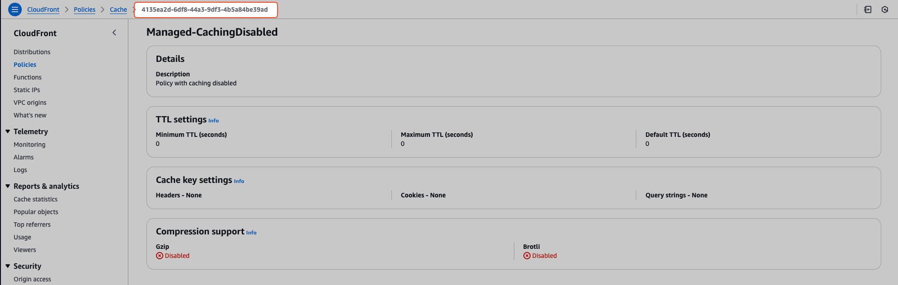
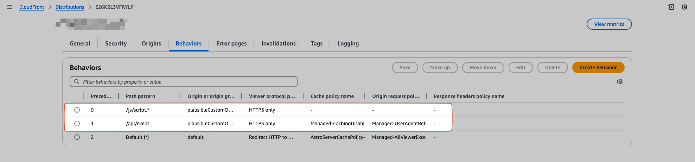

import Callout from '../../../components/Callout.astro';

If you're running a website or web app, you know how crucial analytics are. There are several privacy-focused analytics tools out there (like [Plausible Analytics](https://plausible.io/) and [Fathom](https://usefathom.com/)) that offer a great way to understand your visitors. I personally use Plausible Analytics and have been very happy with it.

However, there's a common issue: many adblockers and browser privacy features try to prevent data collection altogether by blocking requests to known analytics domains, including Plausible’s. This means that your analytics data might be incomplete.

So, how can we improve data accuracy? The Plausible team themselves recommend proxying the analytics requests through your own domain infrastructure if you want more accurate data.

In this post, we'll briefly cover why this proxy approach is effective and then dive straight into the how. We'll set up the proxy using AWS CloudFront, defined and deployed easily using SST (Serverless Stack) as our Infrastructure as Code tool. Let's configure our setup for more accurate analytics!

## Why Proxy Plausible Analytics?
You've set up Plausible Analytics, hoping to get clear insights into your website's traffic. But there's that common hurdle: adblockers and browser privacy features. These tools often maintain blocklists containing domains associated with tracking and analytics – and `plausible.io` is frequently on those lists.

What happens then? When a visitor's browser (with such a blocker) tries to send data to Plausible, the request gets intercepted and blocked *before* it even leaves their machine. The result? That visit simply isn't recorded. This doesn't just slightly lower your numbers; depending on your audience's use of these blockers, it can lead to significantly underreported traffic and unreliable metrics. You might be missing out on understanding a large chunk of your user base.

<Callout type="info">
  Tech-savvy users are of course more likely to use adblockers, which makes them more likely to block analytics requests.
</Callout>

This potential for missing data is why [Plausible officially recommends routing analytics requests through your own domain](https://plausible.io/docs/proxy/introduction#are-you-concerned-about-missing-data) if you want more accurate data:

> Are you concerned about missing data? Proxy our script. This is the option for those who want to get more accurate stats.

The key benefit of setting up a proxy (like we're about to do with CloudFront) is changing the *context* of the analytics requests. The script on your site will send data not directly to `plausible.io`, but to a URL associated with your own domain (e.g., the CloudFront URL we'll generate). From the perspective of browser blockers, these requests now look like standard **first-party** API calls (requests to the same domain the user is visiting), not calls to an external **third-party** tracking domain. Consequently, they are far less likely to be flagged and blocked.

In short, proxying turns Plausible requests into first-party requests, bypassing many blockers and giving you much more accurate and reliable analytics data. It's a small infrastructure tweak for a significant improvement in data quality.

## The Setup: Proxying with CloudFront and SST
Okay, let's implement this with CloudFront and SST. There is an [official guide from Plausible on how to do this in general with CloudFront](https://plausible.io/docs/proxy/guides/cloudfront) but I want to show you how to do it with SST (since that's what I'm using for this blog).

With SST, you can easily deploy various frontend frameworks (like [Astro](https://astro.build/), [React Router](https://reactrouter.com/), [Next.js](https://nextjs.org/), etc.). In my case, I'm using Astro. This is how the most basic [Astro setup with SST](https://sst.dev/docs/component/aws/astro) looks like:

```ts
export const astro = new sst.aws.Astro('Astro', {
	path: 'apps/www', // path to your Astro app
});
```

This already deploys a CloudFront distribution with a default behavior for you.

<Callout type="info">
  You can add a custom domain using the `domain` property. The details of that are out of scope of this post though.
</Callout>

Now, we need to create a new origin for `plausible.io` and add two behaviors to that distribution: one for the Plausible **analytics script** and one for the **event API**.

This is how the config for those look like (it is basically the codification of the configs from the [official guide](https://plausible.io/docs/proxy/guides/cloudfront)):

```ts
const plausibleOrigin = {
	domainName: 'plausible.io',
	originId: 'plausibleCustomOrigin',
	customOriginConfig: {
		httpPort: 80,
		httpsPort: 443,
		originSslProtocols: ['TLSv1.2'],
		originProtocolPolicy: 'https-only',
	},
} satisfies aws.types.input.cloudfront.DistributionOrigin;

const analyticsScriptBehavior = {
	pathPattern: '/js/script.*',
	targetOriginId: plausibleOrigin.originId,
	viewerProtocolPolicy: 'https-only',
	allowedMethods: ['GET', 'HEAD'],
	cachedMethods: ['GET', 'HEAD'],
	defaultTtl: 0,
	maxTtl: 0,
	compress: false,
	forwardedValues: {
		cookies: {
			forward: 'none',
		},
		queryString: false,
	},
} satisfies $util.UnwrappedArray<
	$util.Input<aws.types.input.cloudfront.DistributionOrderedCacheBehavior>
>[number];

const eventApiBehavior = {
	pathPattern: '/api/event',
	targetOriginId: plausibleOrigin.originId,
	viewerProtocolPolicy: 'https-only',
	originRequestPolicyId: 'acba4595-bd28-49b8-b9fe-13317c0390fa',
	cachePolicyId: '4135ea2d-6df8-44a3-9df3-4b5a84be39ad',
	allowedMethods: ['GET', 'HEAD', 'OPTIONS', 'PUT', 'POST', 'PATCH', 'DELETE'],
} satisfies $util.UnwrappedArray<
	$util.Input<aws.types.input.cloudfront.DistributionOrderedCacheBehavior>
>[number];
```

These are configurations for the required Pulumi [aws.cloudfront.Distribution](https://www.pulumi.com/registry/packages/aws/api-docs/cloudfront/distribution/#aws-cloudfront-distribution) and [aws.cloudfront.DistributionBehavior](https://www.pulumi.com/registry/packages/aws/api-docs/cloudfront/distribution/#distributionorderedcachebehavior) resources. SST is using Pulumi under the hood.

The guide mentions using the `Managed-UserAgentRefererHeaders` policy for the event API behavior. You can find policy IDs for managed policies in the [CloudFront docs](https://docs.aws.amazon.com/AmazonCloudFront/latest/DeveloperGuide/using-managed-cache-policies.html#managed-cache-policy-caching-disabled) or by clicking  under CloudFront > Policies > Managed Policies > `[policy name]` in the AWS Console:



Now we have to apply those configs to the underlying CloudFront distribution of our Astro app. This can be done by accessing the CloudFront distribution via the [SST `transform` property](https://sst.dev/docs/components/#transform):

```ts {3-12}
export const astro = new sst.aws.Astro('Astro', {
	path: 'apps/www',
	transform: {
		cdn: (args) => {
			args.origins = $resolve(args.origins).apply((val) => [...val, plausibleOrigin]);
			args.orderedCacheBehaviors = $resolve(args.orderedCacheBehaviors || []).apply((val) => [
				...val,
				analyticsScriptBehavior,
				eventApiBehavior,
			]);
		},
	},
});
```

You can verify that your CloudFront distribution is now correctly configured by checking the Behavior tab in the CloudFront console:



The final step is to adjust the source of your Plausible script which is now served from via your domain instead of `plausible.io`. This is how the script tag should look like:

```html
<script defer data-domain="yourdomain.com" src="/js/script.js"></script>
```

And that's it!

You can verify the setup by checking the network tab of your browser's developer tools. You should see requests to `https://yourdomain.com/js/script.js` and `https://yourdomain.com/api/event` with status codes `2xx`.


## Conclusion

Adblockers may block requests to known analytics domains, including Plausible's. You can get more accurate analytics data by proxying requests through your own domain.

You have learned how to do this for Plausible Analytics with SST and CloudFront but you can apply the same principle to other analytics providers as well or use a different IaC tool.