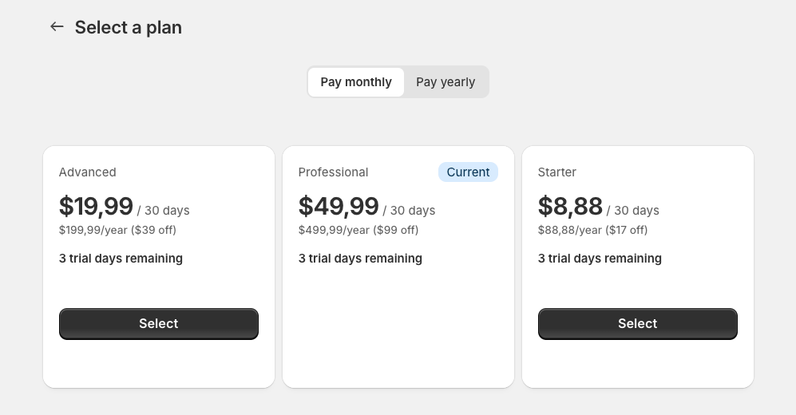
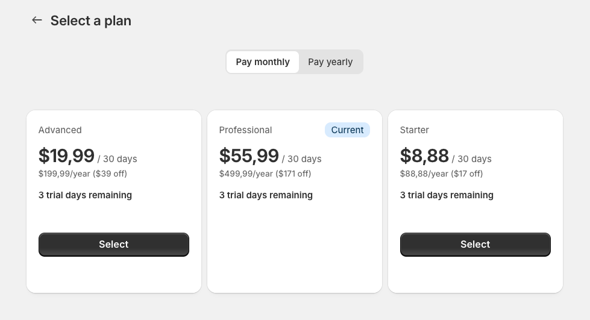
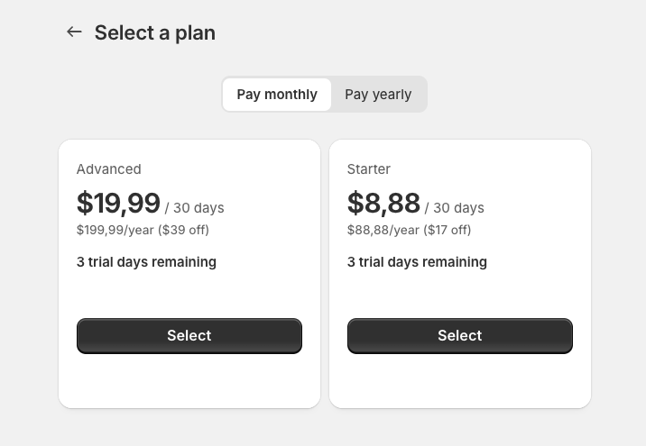
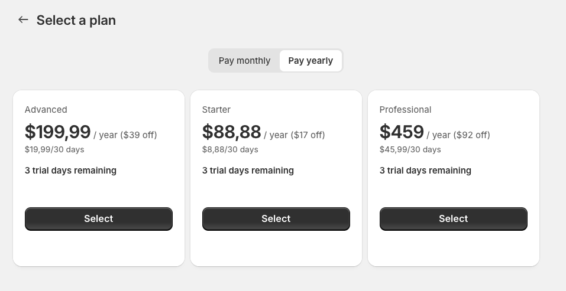

import Callout from '../../../components/Callout.astro';

[Sandro](https://sandrovolpicella.com/) and I have considered changing the pricing of our Shopify app [FraudFalcon](https://fraudfalcon.app/). We want to focus more on Enterprise customers and offer free trials instead of a free plan. We asked ourselves how to change the pricing of our app. What would happen to existing customers if we change or delete pricing plans in our app listing? We couldn't find good information, and even Shopify staff were not very helpful. If you are in a similar situation, this post is for you.

<Callout type="warning">
  Please make sure to test pricing changes on a non-production app first. Things may change, or you might handle the webhooks differently.
</Callout>

## Managed Pricing
First of all, we are using [Shopify Managed App Pricing](https://shopify.dev/docs/apps/launch/billing/managed-pricing). We don't have to build a pricing page or a UI for plan changes ourselves. We simply link to the Managed Pricing page, and Shopify takes care of the rest.

<Callout type="info">
  There are some [limitations to Managed Pricing](https://shopify.dev/docs/apps/launch/billing/managed-pricing#limitations). Even if you don't use the Managed Pricing feature, the insights still apply to your app.
</Callout>

On the Shopify Managed Pricing page, it also shows which plan the customer is subscribed to:

So what happens to the subscription of existing customers if you change or delete a pricing plan? And how is it shown on the Shopify Managed Pricing page?

## Changing an Existing Pricing Plan

In the previous screenshot, you can see that the customer is subscribed to the "Professional" plan. Let's change the price of that plan to $55,99 / month and have a look at the Shopify Managed Pricing page:

As you can see, the customer still sees that they are subscribed to the "Professional" plan. However, the price has changed to $55.99 / month.

**But what happens to the actual subscription of the customer? Nothing.** The pricing plans in your listing are only relevant for new customers. Changes to them are not reflected in the subscriptions of existing customers. If you want to change the price for an existing plan, you have to do it yourself. That is what we wanted, so I won't go into detail on how to do that.

## Deleting a Pricing Plan

What happens if you delete a pricing plan? Nothing. The plan simply disappears from the Shopify Managed Pricing page.

Again, nothing happens to the subscriptions of existing customers.

If you recreate the plan with the exact same name and handle, the new plan will still not be treated as the current plan. Here I have recreated the "Professional" plan with the same name and handle:

## Conclusion

We wanted to adjust the pricing of our plans while keeping their names. However, we didn't want the user to see the plan with the new price as their "current" plan on the Shopify Managed Pricing page because we thought that might be confusing and could prompt them to cancel their subscription, mistakenly believing that they'd be charged more (which isn't the case). So we deleted the existing plans and recreated them with the new price, but with the same name and handle.

In essence, the pricing plans you set up are only relevant at the moment of subscription. Once a customer has subscribed, any modifications to the pricing plans—whether altering or deleting them—do not affect their current subscription. This means that if you want existing subscribers to experience a change in their pricing, you must manage that transition separately. Understanding this behavior is key to making informed decisions when updating your app's pricing structure.