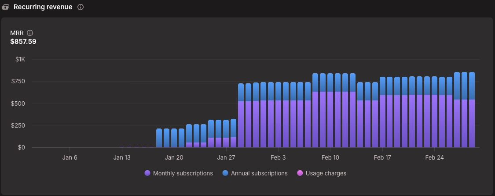

2025 was the year I finally quit being an employee. Here's how my first year of freelancing and building products went – spoiler: better than expected.

## Becoming My Own Boss(?)

The 28th of February was my last day at Hashnode. I knew that about a month in advance, so I had some time to think about what's next. It was always my goal to be my own boss and work on my own terms. I already did some smaller freelance projects on the side in the past and by the start of February I had already found a freelance project together with [Sandro](https://sandrovolpicella.com/) (well, he found it by talking about his situation with a friend whose dad had a project for us). In addition to that, Sandro and I had built a Shopify app called [Fraud Falcon](https://fraudfalcon.app) which was doing ~$850 MRR at that point. So the idea of going solo wasn't completely out of the blue.

The timing didn't feel optimal though. I had bought a house just a few months earlier, I have two young kids (1 y/o at that time) and I was the only one bringing money home. The "golden handcuffs" are real – it's harder to start being self-employed if you already have a certain standard of living.

But if I'd take a new fulltime job, I'd have to commit to it and postpone my goals even further – at least by several months but more realistically by ~2 years. Would the time ever be "optimal"? **Probably not.** So I decided to take the leap and try to work on my own.

## My Goal

**My end goal is freedom.** The ability to work on interesting stuff, to schedule my work around my life and not the other way around. For that to work, I have to stop directly trading my time for money. Time is the most limited resource I have and I want to spend it wisely. I want to be able to make money while I sleep (or doing anything else rather than actual work). I know that sounds cliché but that's the goal.

To make that work, I have to build products/services/SaaS, sell content or anything like that. Fraud Falcon was a start but ~$850 MRR (with two people) wasn't enough to cover my expenses for long.

In order to cover my expenses while building up those desired income streams, I decided to do freelancing. **The goal is to transition from freelancing to my own products over time** and eventually be fully independent. Initially I would have to do quite a lot of freelancing though because the income from Fraud Falcon was negligible at that point.

## Getting Started

I created my personal website (this one you're currently reading) and made a [digital version of my CV](https://wempe.dev/cv) which I can share with potential clients. I also created profiles on [freelancermap.de](https://www.freelancermap.de/profile/285248) and [freelance.de](https://www.freelance.de/Freelancer/333570-Serverless-Cloud-native-Full-stack-Engineer) – the most common freelance platforms here in Germany – plus a few others like [malt.de](https://www.malt.de/profile/jannikwempe), [upwork.com](https://www.upwork.com/freelancers/~01fc68b9d6c15f29cb) and AWS IQ (which will be discontinued soon). I also [renewed my AWS Developer Associate certification](https://wempe.dev/blog/aws-developer-associate-certification-journey) hoping it would help me land projects. Spoiler: it didn't really make a difference.

I started to reach out to projects on those platforms but it wasn't quite as easy as I thought it would be. I was able to move forward because the freelance project with Sandro and another long-running project that I ramped up a little brought the money in. That time wasn't easy though – I wouldn't have been able to continue if those projects ended without having others lined up.

In the beginning of March, Sandro and I also created a GbR (Gesellschaft bürgerlichen Rechts) for our Shopify business. A GbR is the simplest form of a partnership in Germany – no minimum capital, minimal paperwork. Why not just run it through our freelance businesses? In Germany, freelancing ("Freiberufler") and running a trade ("Gewerbe") are legally different things. Freelancing has nice perks like no trade tax and simpler accounting. But selling a SaaS product is a Gewerbe, not freelancing. Mixing them would turn your entire income into Gewerbe income – losing all freelancer benefits. So we keep them separate.

## More Projects, Less Focus

In April, Sandro and I landed another freelance project together – building an internal tool for a German company. We found this one through connections from our existing project. Freelancing was going well, maybe **a bit too well**. I almost lost focus on the actual goal: building my own products instead of trading time for money.

To get back on track, Sandro and I met for a 4-day co-working trip with one goal: build an MVP for a new Shopify app. We prepared by outlining the idea beforehand so we could focus purely on building during those days. A few weeks later, we released [MergeIt](https://mergeit.app) – our second Shopify app.

## From Projects to Retainers

For the two freelance projects Sandro and I were working on together, we negotiated maintenance contracts and transitioned from billing as individuals to billing through our GbR. The contracts include a fixed minimum amount of hours per month. This covers keeping the apps running and updated (like when those React security issues dropped recently). The minimum hours give us predictability and ensure we can always block time for maintenance work. I'd argue it's a win-win for us and our clients. Any additional feature work gets billed on top.

## Status Quo

Financially, 2025 went better than expected. **In just 10 months of freelancing, I made roughly as much as I did in all of 2024** – I'd call that a success. I also built up more savings compared to when I started, which makes the future feel less scary.

On the product side, both Fraud Falcon and MergeIt are making money now. Still far from covering my expenses, but it's progress. Every bit of growth shows me that this path can actually work.

I've also started a new freelance project focused on AI, which I'll continue into 2026. Working on something that's both interesting and pays the bills – can't complain.

## What's Next?

The plan is simple: keep doing what I'm doing, but shift the balance more towards my own products over time. 2025 was about taking the leap and not having to go back to being employed – preventing "the bad". 2026 will be about growing – pursuing "the good".

[Writing content is what brought me here](https://wempe.dev/blog/the-power-of-community-and-content-creation). I need to figure out how to provide valuable content in the age of AI. I also want to find my niche – the thing people would associate with me. That's not easy when you have a lot of interests. But I'll figure it out.

## TLDR

- Left employment, started freelancing in March
- Made roughly the same in 10 months as I did in all of 2024
- Two Shopify apps ([Fraud Falcon](https://fraudfalcon.app) and [MergeIt](https://mergeit.app)) now generating revenue
- Goal for 2026: shift balance from freelancing towards own products
